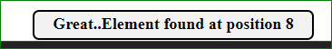

#### Procedure

1. In order to start the experiment, Read the instructions and theory very carefully. 
2. Attempt all the pretest questions and then click on the "Simulation" tab.  
  
Fig.1  
3. As far as you click on the "Simulator", you will be redirected to actual Simulator Section.  
  
Fig.2  
4. Start the experiment by entering the number of elements in the array (N).  
 
Fig.3  
5. Next we have is a textfield, in which you have to enter the array a[N]. 
  
Fig.4  
6. Now in last textfield, you have to enter the element you want to search from the given array itself (X). 
 
Fig.5  
7. In order to search the element you have to click on the "Search Element" button.  
 
Fig.6  
8. In the given textfield ( As shown in the following Figure ), you will get the index of the given number in "Element to be Searched" button. 
 
Fig.6  
