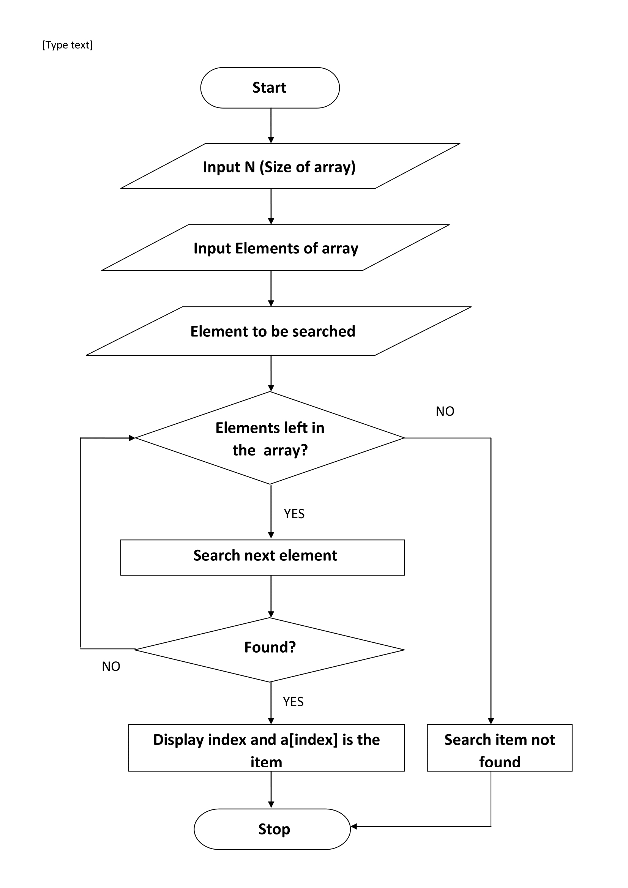
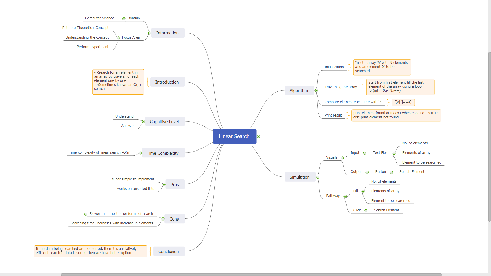

## Storyboard (Round 2)
Experiment 1: To write a python program linear search

### 1. Story Outline:

Lets first know something interesting about linear search. In computational complexity theory, the linear search problem is an optimal search problem introduced by Richard E. Bellman. A linear search or sequential search is a method for finding an element within a list/array. It sequentially checks each element of the list until a match is found or the whole list has been searched.
A linear search sequentially checks each element of the list until it fids an element that matches the target value. If the algorithm reaches the end of the list, the search terminates unsuccessfully. Either way, asymptotically the worst-case cost and the expected cost of linear search are both O(n). 

### 2. Story:

#### 2.1 Set the Visual Stage Description:

When you come to the landing page of our simulator, you will see some options like how many elements you want to give, next you have to enter those elements of array, after that you have to write that number which you want to find from that array. You will be given the index number of the element if it is present in that array Or the title "The element not found" if the element is not in that array.

#### 2.2 Set User Objectives & Goals:

In computer science, a linear search or sequential search is a method for finding an element within a list. It sequentially checks each element of the list until a match is found or the whole list has been searched.
Let us know the objective of this lab.The objective of the lab is to implement linear search algorithm.
The goals of the linear search is that linear search (known as sequential search) is an algorithm which can easily find out the target value within the list. It sequentially checks each element of the list for the target value until a match is found or until all the elements have been searched of the array.

#### 2.3 Set the Pathway Activities:

So let's now know how to work on our simulator-
1. All you have to do is, you have to enter the number of elements, you want to give in that array.
2. After that you have to input all the elements of that particular array.
3. Next you have to input that element which you want to search from array.
4. In last you have to press "Search Element" button which will give you the index of that particular element (if present) else it will give you the title "Element not found".
(In other words, In every iteration, the simulator will compare the target value with the current value of the array. If the values match, return the current index of the array. If the values do not match, move on to the next array element and finally give "Element not found" if the array lasts.)

##### 2.4 Set Challenges and Questions/Complexity/Variations in Questions:

Describe the challenges Here : (guide : Set Challenges and Questions/Complexity/variations in questions according to User’s level, so as to invoke the learners’ interest.  (while traversing, what challenges he will face? how he has to solve and overcome ? descriptive).)

Give 10 Questions here..!!!

##### 2.5 Allow pitfalls:

If the user enters invalid data to the textfield, then the index number will not be displayed by the simulator. At the same time the alert message will be displayed to the user. So as the user will understand that he has entered the incorrect data in the simulator. 

##### 2.6 Conclusion:

To conclude all the basic details about the simulator-

There are 10 questions with different difficulty levels. Assessment/evaluation of the multiple choice questions will be given immediately to the user. When the student clicks on the answer of his choice, the correct answer will be displayed below the question itself. This would enable the student to understand whether he is right or wrong. The approximate time required to understand the procedure to perform the experiment would take about 5 minutes. I order to enter and generate the data, user will take another 5 minutes. Answering the assessment questions will take about 5 minutes. Thus the total time required to perform the experiment will require around  15 minutes.

##### 2.7 Equations/formulas: NA
Type equations here : (guide : ( a separate sheet having equations / programs for the lab exper3ment to be shared along with the Story submissions (1) . You can mark it as numerical reference numbers within the story narration (like we cite in the research papers) and then separately share these equations/programs sheets as a reference, do not include the equations as a whole in the narration))
Tool can be used to integrate formula in Markdown <b> [here](http://latex.codecogs.com/eqneditor/samples/example3.php) </b>

### 3. Flowchart 4
 
link to flow chart Here : Store in the  /flowchart folder within Round2 folder in your repo
 
(guide :The lab proposer should extract logic from the story, prepare a flowchart from the story narration and write the algorithm to execute the black box.  use Google Drawings https://docs.google.com/drawings/ (send the link to your flowchart and also attach .png by exporting it )

### 4. Mindmap:

 Link to mindmap here : Store the mindmap in both .mm & .png extension in the  /mindmap folder and include link of only .pdf verison here
  
 (guide : An elaborate mind map (connecting all the points in the experiment flow ) should be prepared and submitted by the lab proposer. The mind map should be a clear and detailed document that takes into account all minute intri5acies involved in the development of virtual lab. The mindmap should be self-content and any developer across the globe should be able to code it with all those details. using only FreeMind http://freemind.sourceforge.net/wiki/index.php/Main_Page (send the .png file and also the original .mm extension project file. )

### 5. Storyboard :
Storyboard: <a href="Storyboard/carwiper.gif"> [here]</a>
Link to storybaord (.gif file ) here :
(guide: This document should include sketching and description scene wise (duration, action, description). Software to be used for storyboarding : https://wonderunit.com/storyboarder/ (Its a FOSS tool) . tutorial on how to use it https://www.youtube.com/watch?v=LAeCEpG0KX4
