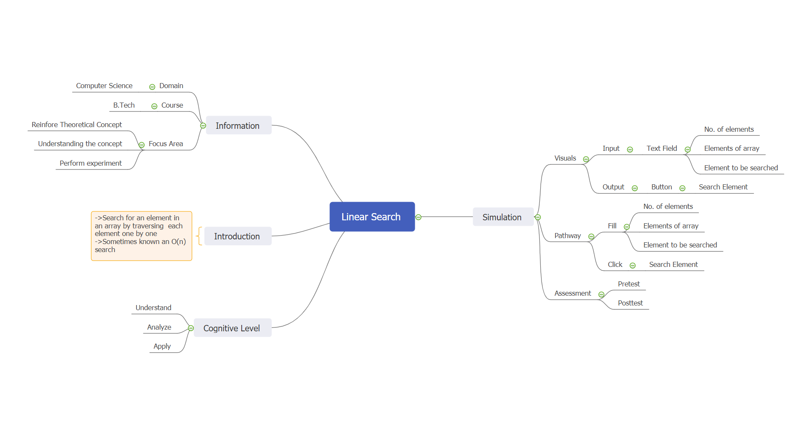

## Storyboard (Round 2)
Experiment 1: To write a python program linear search

### 1. Story Outline:

Lets first know something interesting about linear search. In computational complexity theory, the linear search problem is an optimal search problem introduced by Richard E. Bellman. A linear search or sequential search is a method for finding an element within a list/array. It sequentially checks each element of the list until a match is found or the whole list has been searched.
A linear search sequentially checks each element of the list until it fids an element that matches the target value. If the algorithm reaches the end of the list, the search terminates unsuccessfully. Either way, asymptotically the worst-case cost and the expected cost of linear search are both O(n). O (n) because we have to look at every item in the array. Best-case O (1) because element searched found at I position 

### 2. Story:

The sequential search, also known as the linear search, are the most basic search algorithms and are often the first search method learned in introductory computer science courses.
The basic strategy is straightforward. Every element in the data set is examined in the order presented until the value being searched for is found. If the value being searched for doesn't exist, a flag value is returned (such as -1 for an array or NULL for a linked list).
Sequential search is at best O(1), at worst O(n), and on average O(n). If the data being searched are not sorted, then it is a relatively efficient search. However, if the data being searched are sorted, we can do much better. 

#### 2.1 Set the Visual Stage Description:

When you come to the landing page of our simulator, you will see some options like how many elements you want to give, next you have to enter those elements of array, after that you have to write that number which you want to find from that array. You will be given the index number of the element if it is present in that array Or the title "The element not found" if the element is not in that array.

#### 2.2 Set User Objectives & Goals:

In computer science, a linear search or sequential search is a method for finding an element within a list. It sequentially checks each element of the list until a match is found or the whole list has been searched.
Let us know the objective of this lab.The objective of the lab is to implement linear search algorithm.
The goals of the linear search is that linear search (known as sequential search) is an algorithm which can easily find out the target value within the list. It sequentially checks each element of the list for the target value until a match is found or until all the elements have been searched of the array.

#### 2.3 Set the Pathway Activities:

So let's now know how to work on our simulator-
1. All you have to do is, you have to enter the number of elements, you want to give in that array.
2. After that you have to input all the elements of that particular array.
3. Next you have to input that element which you want to search from array.
4. In last you have to press "Search Element" button which will give you the index of that particular element (if present) else it will give you the title "Element not found".
(In other words, In every iteration, the simulator will compare the target value with the current value of the array. If the values match, return the current index of the array. If the values do not match, move on to the next array element and finally give "Element not found" if the array lasts.)

##### 2.4 Set Challenges and Questions/Complexity/Variations in Questions:

The Challenges and Questions/Complexity/Variations is that our program will not work on Decimals and Characters when given as input in the textfield. Secondly it can be possible in future that this issue will become a Challenge for others in order to improve it.

Q.Which of the following is a disadvantage of linear search? 
a) Requires more space 
<b>b) Greater time complexities compared to other searching algorithms</b>  
c) Not easy to understand 
d) Not easy to implement 
 
Q.What can be the best case and worst case complexity of ordered linear search according to you? 
a) O(nlogn), O(logn) 
b) O(logn), O(nlogn) 
c) O(n), O(1) 
<b>d) O(1), O(n)</b> 

Q.Is there any difference in the speed of execution between linear search (Recursive) vs linear search (lterative)? 
a) Both execute at same speed 
<b>b) Linear search(Iterative) is faster</b> 
c) Linear search(recursive) is faster  
d) No idea  

Q. What is the worst case runtime of linear search (Recursive) algorithm? 
<b>a) O(n)</b> 
b) O(logn) 
c) O(n2) 
d) O(nx) 
 
Q.The array is as follows: 1,2,3,6,8,10. Given that the number 17 is to be searched. At which call it tells that there’s no such element? (By using linear search Recursive algorithm ) 
<b>a) 7th call</b> 
b) 9th call 
c) 17th call 
d) The function calls itself infinite times 

##### 2.5 Allow pitfalls:

If the user enters invalid data to the textfield, then the index number will not be displayed by the simulator. At the same time the alert message will be displayed to the user. So as the user will understand that he has entered the incorrect data in the simulator. 

##### 2.6 Conclusion:

To conclude all the basic details about the simulator-

There are 10 questions with different difficulty levels. Assessment/evaluation of the multiple choice questions will be given immediately to the user. When the student clicks on the answer of his choice, the correct answer will be displayed below the question itself. This would enable the student to understand whether he is right or wrong. The approximate time required to understand the procedure to perform the experiment would take about 5 minutes. In order to enter and generate the index, user will take another 5 minutes. Answering the assessment questions will take about 5 minutes. Thus the total time required to perform the experiment will require around 15 minutes.

##### 2.7 Equations/formulas:

No Equations or Formulas are used here.

### 3. Flowchart :

 

### 4. Mindmap :

 
### 5. Storyboard :

Storyboard: <a href="storyboard/linearsearch.gif"> [Click here]</a>  
